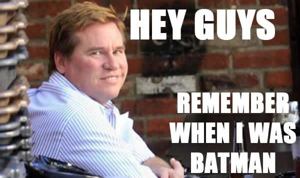

#Project One
================================

###Josh Fadem
-

-----------

###Degenerate Blackjack 
Blackjack, also known as twenty-one, is the most widely played casino banking game in the world.[1] Blackjack is a comparing card game between a player and dealer, meaning players compete against the dealer but not against other players. It is played with one or more decks of 52 cards. The object of the game is to beat the dealer in one of the following ways:

* Get 21 points on the player's first two cards (called a blackjack), without a dealer blackjack.
* Reach a final score higher than the dealer without exceeding 21.
* Let the dealer draw additional cards until his or her hand exceeds 21.

What makes this Degenerate Blackjack is the picture of Val Kilmer in the background.
------------------
My game is a traditional blackjack game comprised of HTML, CSS, & JS/JQuery. Player vs. The house. The Dealer's cards are displayed on top of the screen, and the player's cards are displayed on the bottom of the screen. 
There are four buttons: "Deal", "Hit Me", Hold", and "AC/DC". The "Deal" button starts the game. The "Hit" button will add a card to your hand. If you go over 21, you lose, however due to a bug that I have not yet ironed out, it will not automatically alert you. You will have to click "Hold" to end the round. If you do not bust, either click the "Hit" button again, or click the "Hold" button, which will reveal the Dealer's hand, and alert you as to who won/lost. The AC/DC button turns music on. It does not turn it back off, so make sure you're ready to Rock. The dealer will win all ties by default. There is no scoreboard because this is the Wild West in the 1800's, & Val Kilmer is drunk all the time and doesn't give a shit about keeping score.